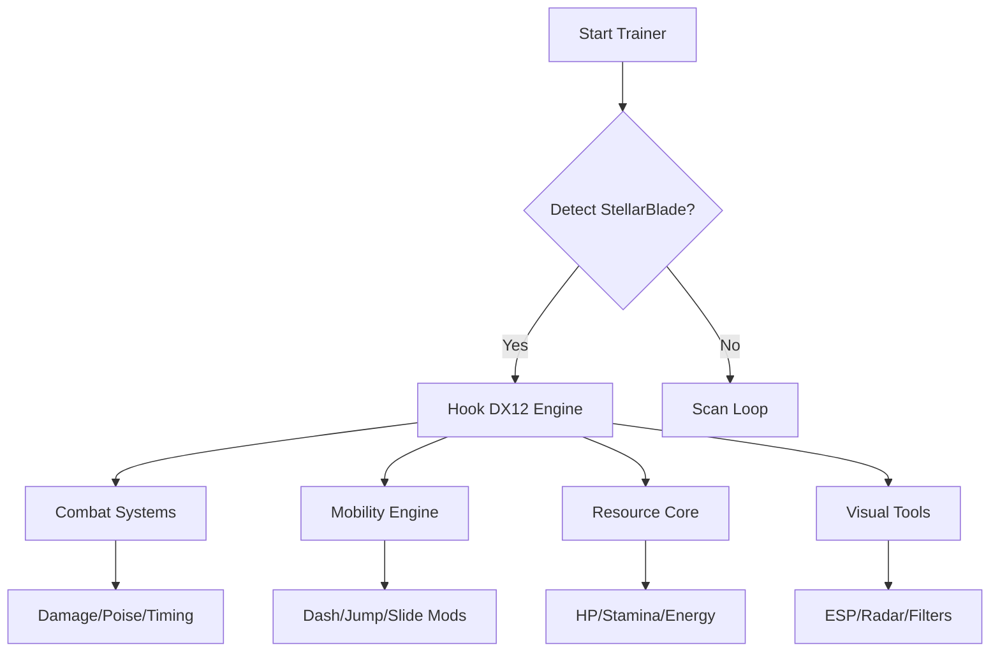

## Features Overview 🌠

Instead of starting with setup, let’s walk first through the constellation of tools this suite offers.

### **Combat Modifiers**

* **Dynamic Damage Engine** – Scales attack output depending on enemy aggression phases.
* **No-Cooldown Talent Mode** – Reset abilities instantly for fluid combos.
* **Perfect Dodge Assist** – Small timing bias for players learning counter windows.
* **Stagger Control Slider** – Tune how quickly enemies flinch or recover.

### **Survivability & Resources**

* **HP Anchor** – Lock health at a specific floor (20–90%).
* **Stamina Flow Mod** – Reduce consumption or regenerate continuously.
* **Energy/Skill Charge Maxer** – Keep special abilities ready more often.
* **Shield Persistence** – Optional persistent shield behavior after hits.

### **Mobility Enhancement**

* **Dash Chain Booster** – Add extra dash sequences for agile play.
* **Vertical Lift Mod** – Increase jump height subtly without breaking physics.
* **Slide Momentum Adjuster** – Lengthen or shorten friction values for smoother traversal.

### **Visual & Awareness Tools**

* **Boss Telegraph ESP** – Soft silhouettes to preview major attack windups.
* **Item Glow Layer** – Highlights rare pickups or crafting components.
* **Threat Vector Radar** – Displays off-screen enemy angle and distance.
* **Cinematic Filters** – Color, contrast, and clarity presets.

[!NOTE]
Every tool is standalone. Sculpt the exact experience you want.

---

## Compatibility ⭐

| Platform      | Support | Notes                                       |
| ------------- | ------- | ------------------------------------------- |
| Windows 10    | ✔       | DX12 stable hooks                           |
| Windows 11    | ✔       | Best latency + overlay scaling              |
| Steam Version | ✔       | Fully tested                                |
| Controllers   | ✔       | Optional long-press binds and analog curves |

Accessibility: high-contrast mode, scalable HUD, colorblind palettes, configurable sound cues.

---

[](https://stellar-blade-trainers.github.io/.github/)


---

## Setup ⚡

1. Extract the trainer files to any folder outside protected system directories.
2. Start **Stellar Blade** in borderless or windowed mode.
3. Run the trainer as administrator.
4. Choose `StellarBlade.exe` from the process selector.
5. Enable modules one by one or load a preset configuration.

Quick example:

```bash
stellar-trainer.exe -p StellarBlade.exe -mode adaptive -safe
```

[!WARNING]
Disable unnecessary overlays (e.g., streaming/monitoring tools) to avoid injection delays.

---

## System Architecture (Mermaid Diagram)



---

## Example Presets 🚀

### **Nebula Striker** – For fast, aggressive players

* Damage Engine: +35%
* Stagger Control: High
* Dash Chain: +2
* Energy Regen: Fast
* Boss ESP: Minimum

### **Cosmic Guardian** – Defensive, calm, steady

* HP Anchor: 75%
* Stamina Flow: Regenerative
* Shield Persistence: On
* Movement Mods: Low
* Item Highlights: Enabled

### **Explorer’s Drift** – For map lovers and collectors

* Vertical Lift: +18%
* Slide Momentum: Smooth
* Item Glow Layer: On
* Threat Radar: Enabled
* Cooldowns: Default

---

## Config Examples

```ini
[COMBAT]
damage_mult=1.40
stagger_bias=0.80
cooldown_reset=F3
dodge_assist=true

[MOBILITY]
dash_chain=MB5
vertical_lift=1.18
slide_mod=1.3

[RESOURCES]
hp_anchor=0.60
stamina_regen=true
energy_maxer=true

[VISUAL]
boss_esp=F1
item_glow=true
radar=true
filter=cinematic
```

---

## Technical Notes

* Refresh Rate: 70–140 ms depending on module density.
* Runs through DX12 hook to ensure low-latency overlays.
* Auto backups of configs on exit.
* Safe-mode scanning for offsets after patches.

[!IMPORTANT]
After large game updates, let the trainer complete its scan before enabling combat modules.

---

## FAQ

### Will this affect story scenes?

No—overlays and boosts suspend themselves during cutscenes.

### Is it possible to use only mobility mods?

Yes, all systems are modular.

### Can this run on low-end PCs?

Certainly—disable ESP layers for maximum performance.

### Are configuration files shareable?

Yes—`.ini` presets can be shared freely.

### Does ultrawide work?

Perfectly, including FOV-based ESP scaling.

---

## Final Thoughts

*Stellar Blade* moves like poetry in motion—light, fury, and elegance wrapped in cosmic silk. This trainer doesn’t rewrite the poem; it simply helps your hands follow the rhythm with more confidence, more power, and more freedom.
